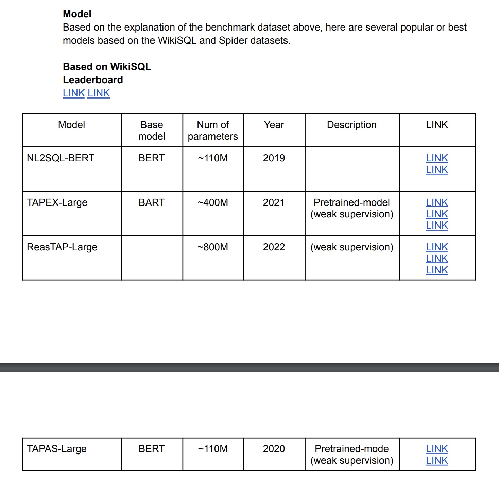

# Database Chatbot

 

  

<!-- TABLE OF CONTENTS -->

  

  
Table of Contents

  <ol>
    <li>
      <a href="#about-the-project">About The Project</a>
      <ul>
        <li><a href="#built-with">Built With</a></li>
      </ul>
    </li>
    <li><a href="#background">Background</a></li>
    <li><a href="#business-values">Business Values</a></li>
    <li><a href="#llm-model">LLM Model</a></li>
    <li><a href="#how-to-works">How to Works</a></li>
    <li>
      <a href="#getting-started">Getting Started</a>
      <ul>
        <li><a href="#installation">Installation</a></li>
      </ul>
    </li>
    <li><a href="#license">License</a></li>
    <li><a href="#Reference">Reference</a></li>
  </ol>
  

<!-- ABOUT THE PROJECT -->
## About The Project

Project ini melakukan research open source model NL2SQL (Natural-Language-to-SQL). Model tersebut dapat diimplementasikan sebagai chatbot yang dapat berinteraksi dengan database. Sehingga kita dapat mengambil atau mengetahui data perusahaan dengan lebih mudah karena hanya menggunakan natural language (bukan menggunakan SQL secara langsung).

This project conducts open-source research on the NL2SQL (Natural-Language-to-SQL) model. This model can be implemented as a chatbot that can interact with the database. We can retrieve or find company data more quickly because we only use natural language (not SQL).

Below is an example of using the model (Tapex model).

## Background
Text-to-SQL is a task to translate a user’s query spoken in natural language into SQL automatically. It is the project that I’m working on at Microsoft.

If this problem is solved, it’s going to be widely useful because the vast majority of data in our lives is stored in relational databases. In fact, healthcare, financial services, and sales all seem to use relational databases exclusively.

Also, writing SQL queries can be prohibitive to non-technical users.

## Business Values
- Can interact with the database using only natural language.
- Users can quickly retrieve the data they need in the database.
- Build a database chatbot for free because it uses an open-source model.

## Research
[PDF](https://huggingface.co/muchad/idt5-base)

 

  

## License
MIT

(<a href="#automed-forecasting">back to top</a>)

